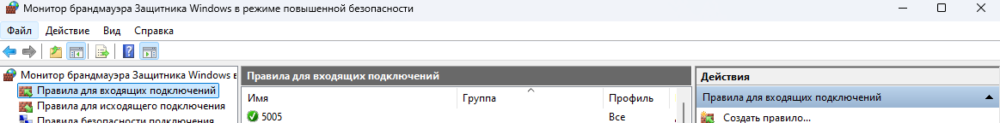
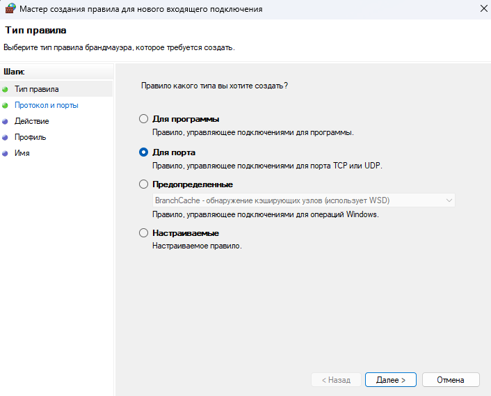
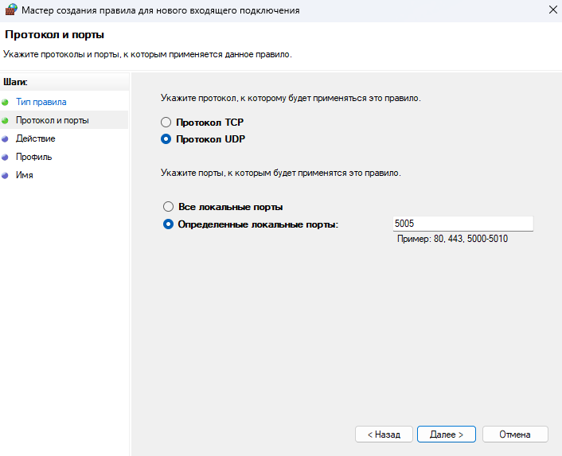
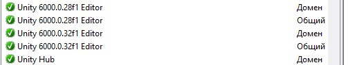

# THIS IS NOT PART OF THE GAME!
This is just a tool for easy testing of the game in the Unity editor.  
If you don't want to bother with all this, then in the Unity project the character will stand still.

## Overview
The application is designed to be used on Android to send data from a gyroscope to a PC via the UDP protocol (for character control).  
The devices MUST be on the same WI-FI network.  
To use this application, you need to install it on Android (the finished version is in Release), as well as follow several steps so that the data can be sent successfully.

## Install
1. Add a new rule for UDP port

Click create rule and follow the images:  

2. Check the Unity status:  

3. Now all that remains is to install the app on your phone, connect to the same WI-FI network, and enter the computer's IP in the application (you can find it out by entering the ipconfig command in the windows command prompt)
